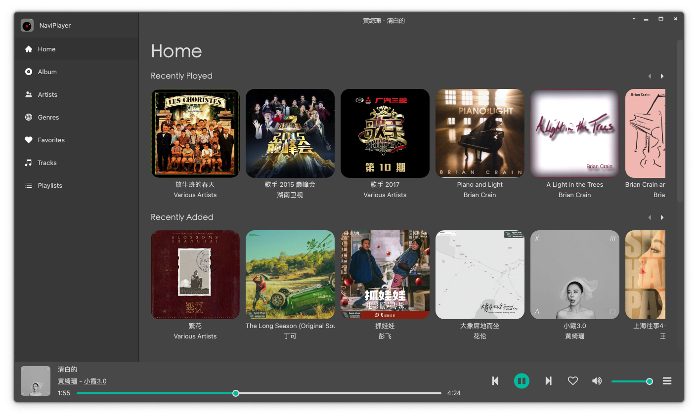
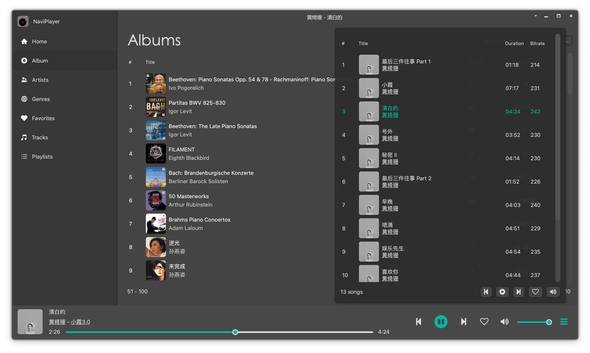
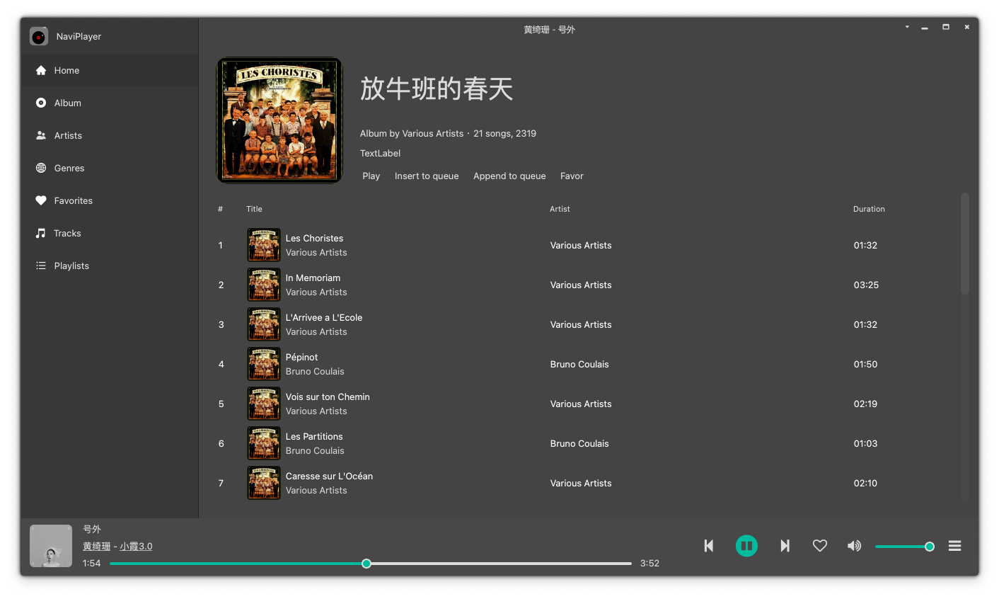

# naviPlayer

naviPlayer是用Qt + FFMpeg写的Subsonic兼容的音乐客户端，现有优秀客户端有[Sonixd](https://github.com/jeffvli/sonixd)， [Feishin](https://github.com/jeffvli/feishin)， [音流](https://music.aqzscn.cn/)，但他们都是基于web构建，占用内存太大，我尝试了音流，启动就占用内存200M，稍点几下就奔300M了，特别是专辑列表没有分页，500张专辑拉到底部内存占用就到600M了，我的丐版macmini真的有点吃不消，所以才用Qt开了这个坑。
我是个业余玩家，边百度边写，希望能坚持下去。

# 2024-12-05

有了一个雏形，能播放音乐了，有些功能有待完善。

